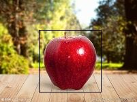

# GrabCut研究报告

## 感想

本次研究最大的困难点是概率统计知识的缺乏，这在好几个方面都有体现。首先是在阅读论文的时候，不明白海量的函数与参数有何所指，不明白为何如此列式；其次是在网上检索学习时感到力不从心，很多地方无法理解；最后是使用库时不确定我是否正确地使用了库中的工具。这些不确定性为代码错误的排查带来了巨大的阻碍。好在经过大量文献的阅读后，上述困难的十之八九都获得了解决。

相比于泊松图像融合，grabcut在互联网上的资料显著少了很多，这让我意识到越往深入研究越难以借助别人的力量。也正是这一点，此次研究锻炼了我寻找工具的能力。在时间、知识、精力有限的情况下，若不是找到了sklearn的GMM计算和networkx的max_flow函数，代码的构建也没有这么顺利。正如grabcut论文中就总结了前人数中图像分割方法，我想，科研很重要的部分就是在前人的基础上寻找路径。倘若不是广博而详尽地了解了前人的研究，grabcut的团队也无法做出这样的突破。阅读文献的必要性全程贯穿这此次研究。

实现grabcut后，我认识到我最急需加强的就是对概率与统计等数学工具的学习。巧妇难为无米之炊，我也明白了为什么大一学生要做科研会如此困难。不过，我有信心迅速地学会各种前置知识，早日能够做到学以致用、融会贯通。

以下是研究过程中即时写下的记录，未加润色。

## 研究记录

不管是GrabCut还是GraphCut，原论文本身十分晦涩难懂。不过，GraphCut稍微简单，在查阅若干博客后就逐渐能理解了。关于GrabCut，对我帮助最大的是YouTube上一个视频 [自動去背P圖神器: (科普)Grabcut和最小割演算法 - YouTube](https://www.youtube.com/watch?v=07nbmSpcG2Q&t=745s)，它基本上把算法的原理详尽地说明了。

## GraphCut

GraphCut的精妙之处在于作出了合理的假设并选择了合适的数学模型。在这个方法中，用户事先指明一些属于前景和背景的像素。作者认为，一个“分割”是好的，应该做到以下两点

1. 相邻的像素越相似，越不应该将其分成两类。
2. 总体上，每个像素应该属于在统计学上最接近的类别。比如说，如果某个像素在统计学上与用户指明的前景像素更相似，那它更应该属于前景。

接着寻找数学工具

* 对于第一点，选一个二元函数来处理相邻的像素。这两个像素的灰度值差别越大，分数就越低。最后把所有的相邻像素的分数加起来。
* 对于第二点，文中选了一个叫做histogram distribution的东西，并写了个$Pr$函数。虽说我知道什么是直方图分布，但不知道这个东西怎么用来算分类的概率。文中还提到了这个函数的选择是受到了MAP-MRF模型的启发，但此模型的统计学原理更加难懂。所以到这时我只知道这里要选择一个判断分类正确的概率大小的函数，概率越大分数越低。
* 使用系数$\lambda$调整前两个要素的权重。
* 最终的目的是使总分数降到最低，文章后面证明了这个系统是可优化的，能找到最低值。

到目前为止，除了一些统计学知识的缺乏，GraphCut的大致理念是搞明白了。博客[经典图割算法中图的构建及实现:Graph-Cut_PandasRan的博客-CSDN博客](https://blog.csdn.net/jy02660221/article/details/83514090)对我的理解起到了重要作用。

## GrabCut

在开头部分，作者对GraphCut的总结中又出现了histogram，这次的描述更细致的，但我还是不知道具体是个什么东西。


起初，由于论文中存在大量不知道为什么这么用的记号，而信息又很零散，阅读起来十分困难。这些文章习惯于给个不知道干什么用的公式然后再慢慢解释。由于我没有做过相关研究，不知道图像领域都有哪些常见的理论，所以难以理解GrabCut的思想。经过知乎、Google、YouTube的三方查阅，我逐渐把握了关键要素。（这其中的中文资料实在是少）。

GrabCut依然聚焦于GraphCut的两个要素。不同的是，在GraphCut的第二个因素上，GrabCut的作者对有3个通道的彩色图像使用高斯混合模型GMM。


这就是个我不知道的数学工具。不过得知这一点后，万能的知乎恰好有解释（有高人指点说线性代数的学习过程中会遇到这些东西，但此时我对线性代数的理解仅限于最基本）。参考了[高斯混合模型（GMM） - 知乎 ](https://zhuanlan.zhihu.com/p/30483076)之后，我才逐渐理解了论文中(9)的意义所在。

关于GrabCut的算法部分，会写在Coding中的步骤中。

## Coding

### 步骤

1. 确定最初的框框，提取框内作为$T_U$，框外全是背景$T_B$。
2. 分别计算框内外的GMM，然后将框内的像素重新归类到框外，重复到收敛。
3. 计算权重，建立图，进行最小割算法。
4. 重复以上三项。

### 详细实现

如果我们要抠出下面的苹果。我们框住的矩形的顶角是(39, 51)和(144, 144)。


#### 步骤一

```python
# 引入图片
image: np.ndarray = cv2.imread('apple2.jpeg').astype(np.float64)
g_height, g_width, _ = image.shape
original_mask = np.zeros([g_height, g_width], dtype=np.uint8)  # 后面赋予权重的时候需要用到
mask = np.zeros([g_height, g_width], dtype=np.uint8)  
left_up = [39, 51]
right_down = [144, 144]
# 使用mask标记，1表示前景，0表示背景
mask[left_up[0]:right_down[0], left_up[1]:right_down[1]] = 1
original_mask[left_up[0]:right_down[0], left_up[1]:right_down[1]] = 1
```

#### 步骤二

这里使用sklearn.mixture.GaussianMixture直接对数据训练高斯混合模型，十分便利。受到[sklearn之高斯混合模型_月疯的博客-CSDN博客_sklearn 高斯混合模型](https://blog.csdn.net/chehec2010/article/details/116170822)的启发。

```python
for i in range(3): # 这里计算十分缓慢，所以只迭代3次
    model_U, model_B = train_gmm()
    for _h in range(left_up[0], right_down[0]):
        for _w in range(left_up[1], right_down[1]):
            # if mask[_h, _w] == 1:
            classify(model_U, model_B, _h, _w)
            
def train_gmm():
    u_array = []
    b_array = []
    # 将前景和背景化为序列
    for h in range(g_height):
        for w in range(g_width):
            if mask[h, w] == 1:
                u_array.append(image[h, w])
            else:
                b_array.append(image[h, w])
    _model_U = GaussianMixture(5)  # 论文中推荐K=5
    _model_U.fit(u_array)
    _model_B = GaussianMixture(5)
    _model_B.fit(b_array)
    return _model_U, _model_B

def classify(model_f: GaussianMixture, model_b: GaussianMixture, h, w):
    prob_f = model_f.score_samples([image[h, w]])
    prob_b = model_b.score_samples([image[h, w]])
    if prob_f < prob_b:
        mask[h, w] = 0

```

#### 步骤三

受到[流 — NetworkX 2.8 文档 (osgeo.cn)](https://www.osgeo.cn/networkx/reference/algorithms/flow.html)的启发，我得知有networkx可以计算mincut，十分便利。

```python
def compute_beta():
    total = 0
    for (n1, n2) in graph.edges:
        total += ((image[n1] - image[n2]) ** 2).sum()
    total /= len(graph.edges)
    return 1 / total / 1

def compute_neighbour_cost(_u, _v):
    return 0 if mask[_u] == mask[_v] else gamma * np.exp(-beta * ((image[_u] - image[_v]) ** 2).sum())

def compute_region_cost(_node):
    data = np.array([image[_node]])
    if original_mask[_node] == 1:
        capacity_s = np.log(np.exp(model_B._estimate_weighted_log_prob(data)[0]).sum()) + \
                     model_B._estimate_log_weights()[model_B.predict(data)[0]]
        capacity_t = np.log(np.exp(model_U._estimate_weighted_log_prob(data)[0]).sum()) + \
                     model_U._estimate_log_weights()[model_U.predict(data)[0]]
        graph.add_edge('S', _node, capacity=-capacity_s)
        graph.add_edge(_node, 'T', capacity=-capacity_t)
    else:
        graph.add_edge('S', _node, capacity=0)
        graph.add_edge(_node, 'T', capacity=2 * gamma)
 
# 建立图
grid = grid_graph(dim=(g_width, g_height))
graph = DiGraph(grid)
graph.add_node('S')
graph.add_node('T')
# 赋予边权重
beta = compute_beta()
for edge in graph.edges:
    graph.add_edge(*edge, capacity=compute_neighbour_cost(*edge))
for node in graph.nodes:
    if node != 'S' and node != 'T':
        compute_region_cost(node)
# 进行max-flow-min-cut算法
cut_value, partition = minimum_cut(graph, 'S', 'T')
reachable, non_reachable = partition
cut_set = set()
# 依据networkx的文档，求要切的边
for u, neighbours in ((n, graph[n]) for n in reachable):
    cut_set.update((u, v) for v in neighbours if v in non_reachable)
# 对mask重新标注
for (_n1, _n2) in cut_set:
    if 'S' == _n1:
        mask[_n2] = 0
    if 'T' == _n2:
        mask[_n1] = 1
```

经过上述操作，就成功进行了一次迭代。依据论文，迭代要持续至收敛，但这个程序跑起来太慢了，5次迭代就要超过1分钟的运算时间。于是只迭代10次。效果还行。

  

左：原图；中：opencv的结果；右：我的结果


虽然极力地寻找原因，但是我的分割依然有很多细节错误，例如边界不干净、中间有漏洞、有零碎的背景被划分为前景。在经过十几个小时的研究后，我最后还是没有把这个算法变得完美，也不知道问题出在何处。经过与同学的交流，我得知opencv中的grabcut似乎与原论文中所述并不一致，最后作罢。（没有那么多时间研究opencv源码）

最后是完整代码

```python
from sklearn.mixture import GaussianMixture
from cv2 import cv2
import numpy as np
from networkx.classes.digraph import DiGraph
from networkx.algorithms.flow.maxflow import minimum_cut
from networkx import grid_graph
from time import time

image: np.ndarray = cv2.imread('apple2.jpeg').astype(np.float64)
temp_image = image.copy().astype('uint8')
g_height, g_width, _ = image.shape
original_mask = np.zeros([g_height, g_width], dtype=np.uint8)
mask = np.zeros([g_height, g_width], dtype=np.uint8)
gamma = 50


def binary2image_for_debug(filename):
    _mask = np.zeros([g_height, g_width, 3])
    for h in range(g_height):
        for w in range(g_width):
            if mask[h, w] == 1:
                _mask[h, w] = [255, 255, 255]
    # cv2.imshow('1', _mask)
    # cv2.waitKey(0)
    cv2.imwrite('test\\' + filename + '.jpg', _mask)


def compute_neighbour_cost(_u, _v):
    return 0 if mask[_u] == mask[_v] else gamma * np.exp(-beta * (image[_u] - image[_v]) @ (image[_u] - image[_v]))


def compute_region_cost(_node):
    data = np.array([image[_node]])
    if original_mask[_node] == 1:
        capacity_s = np.log(np.exp(model_B._estimate_weighted_log_prob(data)[0]).sum()) + \
                     model_B._estimate_log_weights()[model_B.predict(data)[0]]
        capacity_t = np.log(np.exp(model_U._estimate_weighted_log_prob(data)[0]).sum()) + \
                     model_U._estimate_log_weights()[model_U.predict(data)[0]]
        graph.add_edge('S', _node, capacity=-capacity_s)
        graph.add_edge(_node, 'T', capacity=-capacity_t)
    else:
        graph.add_edge('S', _node, capacity=0)
        graph.add_edge(_node, 'T', capacity=2 * gamma)


def classify(model_f: GaussianMixture, model_b: GaussianMixture, h, w):
    data = np.array([image[h, w]])
    prob_f = np.log(np.exp(model_f._estimate_weighted_log_prob(data)[0]).sum())
    prob_b = np.log(np.exp(model_b._estimate_weighted_log_prob(data)[0]).sum())
    if prob_f < prob_b:
        mask[h, w] = 0
    else:
        mask[h, w] = 1


def train_gmm():
    u_array = []
    b_array = []
    for h in range(g_height):
        for w in range(g_width):
            if mask[h, w] == 1:
                u_array.append(image[h, w])
            else:
                b_array.append(image[h, w])
    _model_U = GaussianMixture(5)
    _model_U.fit(u_array)
    _model_B = GaussianMixture(5)
    _model_B.fit(b_array)
    return _model_U, _model_B


def compute_beta():
    total = 0
    for (n1, n2) in graph.edges:
        total += (image[n1] - image[n2]) @ (image[n1] - image[n2])
    total /= len(graph.edges)
    return 1 / total / 2


def draw(event, x, y, flags, *args):
    if event == cv2.EVENT_LBUTTONDOWN or flags == cv2.EVENT_FLAG_LBUTTON:
        cv2.circle(temp_image, [x, y], 5, [0, 0, 0], cv2.FILLED)
        cv2.circle(original_mask, [x, y], 5, 0, cv2.FILLED)


def interact():
    cv2.namedWindow('interact')
    cv2.setMouseCallback('interact', draw)
    while True:
        cv2.imshow('interact', temp_image)
        key = cv2.waitKey(1)
        if key & 0xFF == ord('q'):  # 如果key是q的ascii码就break
            break
    cv2.destroyAllWindows()


if __name__ == '__main__':
    a, b, c, d = cv2.selectROI('select', image.astype(np.uint8), False, False)
    cv2.destroyAllWindows()
    left_up = [b, a]
    right_down = [b + d, c + a]
    cv2.rectangle(temp_image, [a, b], [a + c, b + d], [0, 0, 0], 1)
    original_mask[left_up[0]:right_down[0], left_up[1]:right_down[1]] = 1
    interact()
    cv2.imwrite('test/test.jpg', temp_image)
    grid = grid_graph(dim=(g_width, g_height))
    graph = DiGraph(grid)
    beta = compute_beta()

    # step 1
    t0 = time()
    mask = original_mask.copy()
    # create BMM for U and B
    for ___ in range(10):
        print(f'round {___}\n')
        t0 = time()
        model_U, model_B = train_gmm()
        for _h in range(left_up[0], right_down[0]):
            for _w in range(left_up[1], right_down[1]):
                if original_mask[_h, _w] == 1:
                    classify(model_U, model_B, _h, _w)
        model_U, model_B = train_gmm()
        print(f'time2 {time() - t0}')
        t0 = time()
        binary2image_for_debug('before')

        grid = grid_graph(dim=(g_width, g_height))
        graph = DiGraph(grid)
        graph.add_node('S')
        graph.add_node('T')

        print(f'time3 {time() - t0}')
        t0 = time()
        for edge in graph.edges:
            graph.add_edge(*edge, capacity=compute_neighbour_cost(*edge))
        print(f'time4 {time() - t0}')
        t0 = time()

        for node in graph.nodes:
            if node != 'S' and node != 'T':
                compute_region_cost(node)

        print(f'time5 {time() - t0}')
        t0 = time()
        cut_value, partition = minimum_cut(graph, 'S', 'T')
        reachable, non_reachable = partition
        cut_set = set()
        for u, neighbours in ((n, graph[n]) for n in reachable):
            cut_set.update((u, v) for v in neighbours if v in non_reachable)
        for (_n1, _n2) in cut_set:
            if 'S' == _n1:
                mask[_n2] = 0
            if 'T' == _n2:
                mask[_n1] = 1
        binary2image_for_debug('after')
    for _h in range(g_height):
        for _w in range(g_width):
            if mask[_h, _w] != 1:
                image[_h, _w] = 0
    cv2.imwrite('test\\result.jpg', image)

```

